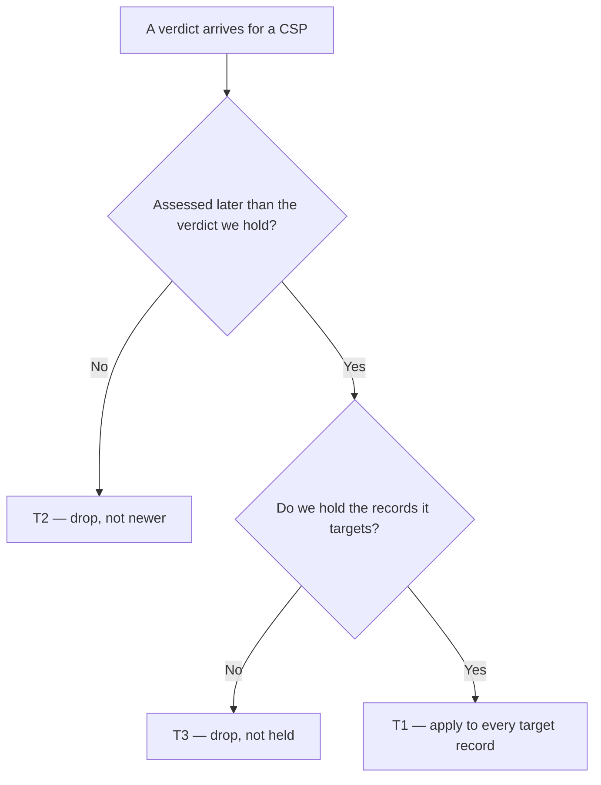

# Quality Verdict in Routing — what DAS does when Quality judges a CSP

| | | | |
|---|---|---|---|
| **Owner** — Ashish Raj (PM) | **Reviewer** — Saurabh Goyal (EM) | **Status** — Signed off | **Sign-off** — Signed off · 11 Aug 2026 |
| **Version** — v1.0 · 11 Aug 2026 | **Consulted — Quality OS** — Akhil | | |

---

## 1. Objective & Definition of Success

**Objective.** A customer is not handed to a CSP that Quality has judged non-compliant, and a CSP who climbs back out is given work again — because routing acts on Quality's verdict from the moment it is issued.

**Boundary.** This spec governs one thing: how the routing domain receives a CSP's Quality verdict and where it records it. It ends at the recorded verdict. Everything the recorded verdict then feeds is existing behaviour and must stay that way (G4).

It leaves unchanged:
- **How Quality decides the verdict.** The metrics, the cycles, the thresholds and the state machine behind them stay Quality's.
- **How a recorded verdict becomes a routing decision.** The exposure band calculation, the routing pipeline, its eligibility gates and its ranking are untouched. This spec changes what the band calculation *reads*, never how it computes (G4, AC-GRD-4).
- **Every other input to the band** — enforcement posture, exit state, zone eligibility, capacity. The most restrictive input still wins, exactly as before (AC-REG-1).
- **Work already in the CSP's hands.** A verdict applies from the moment it lands and does not reach back: allocations already assigned, accepted or active stay with him. This matches D&A OS §4.2, where a quality block stops new assignments and leaves existing connections alone (AC-REG-2).
- **How a new exposure record starts.** When a CSP is authorised in a zone he did not hold before, that new record begins at the eligibility path's own starting point, carrying no verdict — his standing is written to it by the next verdict Quality issues, not backdated onto it at creation (AC-REG-4). For up to one cycle, a blocked CSP is therefore routable in newly authorised territory. This is a conscious call, not an oversight.
- **What happens when no verdict arrives.** Routing continues on the CSP's last recorded verdict. Nobody is blocked or released by silence (AC-REG-5).
- **What the CSP sees.** His quality strip in the app reads the Quality domain directly, not routing. No screen changes (AC-REG-3, §4).

Hard limits: a verdict never creates a routing exposure record (G1), and never reaches a zone outside the scope Quality declared (G2).

### Dependency — four defects downstream that only this spec makes visible

G4 promises the downstream algorithm keeps working. It works today only because no verdict has ever reached it. Turning the signal on exposes four pre-existing faults in the band calculation and the routing rank.

**None of these is to be fixed under this spec.** However the system behaves today, it must behave the same way after this ships — that is what G4 means and what AC-GRD-4 tests. They are listed only because each one changes what a CSP actually experiences the day the signal goes live, and the reviewer should not meet them by surprise. Each needs its own change, owned by the allocation domain.

| # | What happens | Why it is wrong |
|---|---|---|
| D1 | A CSP recovering from non-compliant lands on the default band, because the band calculation has no case for a recovering verdict. The recovery-window parameter is configured and read nowhere | D&A OS §4.2 gives recovery its own reduced band for the recovery window. The default band carries **more** exposure than the at-risk band, so he is over-exposed, not under |
| D2 | A CSP who is fully compliant but still climbing back from at-risk ranks in the **lowest** quality tier — below at-risk CSPs and below brand-new CSPs — for the whole climb | The rank reads the band and then asks "is he at risk?". A compliant CSP in the reduced band answers no, so he falls to the bottom tier. D&A OS §4.3 reserves that tier for recovery from non-compliant |
| D3 | Regaining the full band takes one more compliant cycle than the parameter says, because the consecutive-compliant counter is incremented after the band is derived, not before | D&A OS §4.2 says full exposure at **at least** that many consecutive compliant cycles, not one more |
| D4 | The quality calculation reads the *combined* band to decide whether to hold full exposure. A CSP held down by enforcement therefore loses quality's memory of being full, and must re-earn it after enforcement lifts | Quality's own standing is not stored apart from the combined band, so one domain's restriction silently consumes another's earned position |

### Guardrails — promises that hold on every path

| ID | Guardrail | One line | Anchors |
|---|---|---|---|
| G1 | **No phantom exposure** | A verdict never brings a (CSP, zone) exposure record into existence — it only updates records that already exist. | R2 · AC-GRD-1 · AC-DRP-1 · AC-DRP-2 · MQ-3 |
| G2 | **No scope widening** | A verdict that names a zone changes that zone and no other. | R2b · AC-GRD-2 · AC-APP-2 · MQ-1 |
| G3 | **No stale overwrite** | A verdict never replaces one assessed later than it, or at the same instant as it, however late it arrives. | R3 · AC-GRD-3 · AC-DRP-3 · MQ-2 |
| G4 | **Downstream untouched** | Everything downstream of the recorded verdict — the exposure band calculation, the routing pipeline, its gates and its ranking — behaves exactly as it does today. This spec changes the input, never the algorithm. | R1c · AC-GRD-4 · AC-REG-1 · AC-REG-2 · MQ-4 |

### Success metrics

| ID | Metric | Baseline | Target | Source |
|---|---|---|---|---|
| M1 | **Verdict accuracy.** Share of a CSP's exposure records whose recorded verdict is the same as Quality's current verdict for him. No difference between the two systems, on any record, for any CSP. Records created since that verdict landed are excluded — they legitimately hold none until the next one (AC-REG-4) | n/a — new capability. Routing has never received a verdict; what it holds is frozen from the 18 Jul 2026 seed and agrees with Quality only by coincidence | 100% | MQ-1 |

Accuracy is the whole measure. Everything else this spec promises follows from it: if the verdict in routing is Quality's verdict, and the algorithm below it is untouched (G4), then the routing outcome is right by construction. Accuracy is measured on the **verdict**, not on the band — the band faults in D1–D4 are real but they are not this spec's to move, and folding them in would hide whether the signal itself arrived.

**Invariant (not a metric):** G1 — exposure records created by a verdict = 0, zero tolerance. Monitored via MQ-3, not trended.

---

## 2. User Stories & Rules

| ID | Story | MUST | MUST NOT |
|---|---|---|---|
| R1 | As routing, I want the CSP's current Quality verdict so that I stop sending new customers to a CSP Quality has judged non-compliant, and start again when he recovers. | **(a)** Accept four verdicts as the CSP's judged standing: compliant, at risk, non-compliant, recovering. **(b)** Record the verdict against the CSP's exposure records as soon as it arrives. **(c)** Leave the recorded verdict to feed the exposure band by the existing rules, unchanged (G4). | Treat "could not judge him" as a verdict. A signal that Quality had insufficient data leaves the recorded verdict and the band exactly as they were — a CSP cannot be released from a block by going quiet. |
| R2 | As the Quality domain, when I name no zone I mean the CSP everywhere; when I name a zone I mean that zone only. | **(a)** A verdict that names no zone targets every exposure record the CSP holds. **(b)** A verdict that names a zone targets that one record. **(c)** Read an absent zone, an empty zone, and the placeholder `DEFAULT` as "no zone named". | **(a)** Bring an exposure record into existence (G1). **(b)** Apply a zone-named verdict to any other zone of that CSP, or widen it to all zones because the named zone is unrecognised (G2). |
| R3 | As routing, I want the CSP's latest judged standing, not the last message that happened to arrive. | Keep the verdict Quality assessed most recently, comparing Quality's assessment time — never arrival time. | Let a re-delivered or delayed verdict replace a verdict assessed later than it, or at the same instant as it (G3). |
| R4 | As the PM, I want to know a verdict was acted on, because this pipe has been silently dead once already. | Record, for every verdict received, whether it was applied or dropped and the reason for the drop. | Discard a verdict without a recorded reason. |

---

## 3. System Behaviour

### 3a. System flow chart

Which records a verdict targets is R2's answer, not a step in its own right: no zone named means all the CSP's records, a zone named means that one.

**Precedence — simultaneous verdicts.** Two verdicts for the same CSP arriving together are resolved by Quality's assessment time: the later one is applied and the other is dropped, whichever is read first (AC-RACE-1). Quality issues one verdict per CSP per cycle, so two *different* verdicts sharing an assessment time do not arise; a verdict matching the recorded assessment time is a re-delivery, and T2 drops it.

### 3b. State transition table — canon

Lifecycle of the **recorded verdict** on a CSP's exposure record (created when the first verdict for that CSP is applied). Its states are the four verdicts — compliant, at risk, non-compliant, recovering — plus *none* before the first verdict lands. The exposure record's own lifecycle is owned by the eligibility path and is out of scope; so is the band the recorded verdict feeds (G4).

| ID | From | Action / Trigger | Rule / Check | To | Side-effects |
|---|---|---|---|---|---|
| T1 | Any recorded verdict, or none | A verdict arrives | Assessed later than the recorded verdict (R3), and the CSP holds the records it targets (R2) | The arriving verdict, on every target record | Band re-derived on each record by the existing rules, unchanged (R1c, G4); no record created (G1); no record outside the target set touched (G2); application recorded (R4). |
| T2 | Any | A verdict arrives assessed earlier than, or at the same instant as, the recorded verdict — including a re-delivery of it | — | Unchanged | Dropped; reason recorded as not newer (R3, R4, G3). A re-delivery costs nothing and loses nothing. |
| T3 | Any | A verdict arrives naming a zone routing does not hold for this CSP, **or** the CSP holds no exposure record at all | — | Unchanged | Dropped; reason recorded as not held (R4). No exposure record is created (G1). No widening to his other zones (G2). |

**Not reachable: the no-verdict signal.** Quality also reports when it could not judge a CSP. Routing does not listen for it, so it has no transition here. If it ever were wired, R1's MUST NOT governs: it changes nothing, and a block stays a block (AC-REG-6).

---

## 4. Screen Requirements

**None.** This spec changes no screen. Routing has no interface, and the CSP's existing quality strip is served from the Quality domain directly, so it neither gains nor loses anything here (AC-REG-3). Recorded as an Override.

---

## 5. Measurement

| ID | The system must be able to answer… | Feeds |
|---|---|---|
| MQ-1 | For every CSP, and for every exposure record he holds, whether the recorded verdict is the same as Quality's current verdict for him — counting only records that already existed when that verdict landed. | M1 · R1 · R2a · G2 |
| MQ-2 | For each evaluation cycle: how many verdicts Quality issued, how many routing applied, and how many it dropped — broken down by drop reason. This is the diagnostic behind any accuracy gap MQ-1 shows. | R4 · G3 |
| MQ-3 | Whether any exposure record came into existence as a result of a verdict. | G1 invariant |
| MQ-4 | For a given set of CSP inputs, whether the exposure band and the routing outcome are the same as they would have been before this spec shipped. | G4 |

---

## 6. Acceptance Criteria

> Worked examples use CSP `a0a0m0` (three zones: `zone_1101`, `zone_3092`, `india_grid_002192694`), CSP `a0b1u5` (one zone: `zone_3092`) and CSP `a0a7h4` (authorised nowhere in routing). Cycle close is 12 Aug 2026, 02:00 IST. The CSP ids and zone ids are real; which CSP sits in which zone is illustrative, so QA should substitute a genuine multi-zone CSP and the real cycle cadence before these become tests.

### APP — Applying a verdict (T1)

| AC | Given / When / Then | Verifies | Status |
|---|---|---|---|
| AC-APP-1 | **Given** `a0a0m0` holds exposure records in `zone_1101`, `zone_3092` and `india_grid_002192694`, all recorded compliant from a verdict assessed 29 Jul 02:00, **When** Quality issues a non-compliant verdict for `a0a0m0` at 02:00 on 12 Aug naming no zone, **Then** all three records read non-compliant, and `a0a0m0` still holds exactly three records. | R1b · R2a · T1 · G1 | Settled |
| AC-APP-2 | **Given** the same three compliant records, **When** the 02:00 non-compliant verdict names `zone_3092`, **Then** only the `zone_3092` record reads non-compliant; `zone_1101` and `india_grid_002192694` still read compliant. | R2b · T1 · G2 | Settled |
| AC-APP-3 | **Given** the same three compliant records, **When** the 02:00 non-compliant verdict carries the literal zone value `DEFAULT`, **Then** all three records read non-compliant — the placeholder is read as "no zone named", not as a zone. | R2c · T1 | Settled |
| AC-APP-4 | **Given** `a0b1u5` is recorded non-compliant in `zone_3092`, **When** Quality issues a recovering verdict for him at 02:00 on 12 Aug, **Then** the `zone_3092` record reads recovering and the band on that record is re-derived by the existing rules — this spec asserts the input, not the resulting band (see D1). | R1a · R1c · T1 · G4 | Settled |

### DRP — Verdicts not applied (T2, T3)

| AC | Given / When / Then | Verifies | Status |
|---|---|---|---|
| AC-DRP-1 | **Given** `a0b1u5` holds an exposure record only for `zone_3092`, **When** a non-compliant verdict names `india_grid_002192694`, **Then** the `zone_3092` record is unchanged, no record exists for `india_grid_002192694`, and the drop is recorded as not held. | R2 MUST NOT (a)(b) · R4 · T3 · G1 · G2 | Settled |
| AC-DRP-2 | **Given** `a0a7h4` holds no exposure record anywhere in routing, **When** a compliant verdict arrives for him at 02:00 on 12 Aug, **Then** no record is created and the drop is recorded as not held. | R4 · T3 · G1 | Settled |
| AC-DRP-3 | **Given** `a0a0m0`'s three records read compliant from a verdict assessed 12 Aug 02:00, **When** a non-compliant verdict assessed 11 Aug 02:00 is delivered at 12 Aug 09:00, **Then** all three records still read compliant and the drop is recorded as not newer. | R3 · T2 · G3 | Settled |

### DUP — Duplicate delivery (T2)

| AC | Given / When / Then | Verifies | Status |
|---|---|---|---|
| AC-DUP-1 | **Given** the AC-APP-1 verdict has been applied to all three records, **When** the identical verdict is delivered again at 02:05, **Then** all three records still read non-compliant and nothing further is written against them. | T2 · R4 | Settled |

### RACE — Simultaneous verdicts

| AC | Given / When / Then | Verifies | Status |
|---|---|---|---|
| AC-RACE-1 | **Given** `a0a0m0`'s three records read at risk from a verdict assessed 10 Aug 02:00, **When** two verdicts arrive together at 12 Aug 09:00 — compliant assessed 12 Aug 02:00 and non-compliant assessed 11 Aug 02:00 — **Then** all three records read compliant whichever of the two is read first, and the non-compliant verdict is dropped as not newer. | R3 · T1 · T2 · G3 | Settled |

### BV — Boundary values (assessment time)

| AC | Given / When / Then | Verifies | Status |
|---|---|---|---|
| AC-BV-1 | **Given** `a0a0m0`'s records hold a compliant verdict assessed 12 Aug 02:00:00, **When** a verdict assessed at exactly 12 Aug 02:00:00 arrives, **Then** it is dropped as not newer and the records are unchanged — equal is not later. | R3 · T2 · G3 | Settled |
| AC-BV-2 | **Given** the same records, **When** a non-compliant verdict assessed 12 Aug 02:00:01 arrives, **Then** all three records read non-compliant. | R3 · T1 | Settled |

### WF — Workflows

| AC | Given / When / Then | Verifies | Status |
|---|---|---|---|
| AC-WF-1 | **Given** `a0a0m0` is compliant across his three zones and holds one accepted allocation in `zone_1101`, **When** Quality issues non-compliant at 02:00 on 12 Aug and a new connection is requested in each of his three zones at 03:00, **Then** all three records read non-compliant, none of the three new connections is assigned to him, and his accepted `zone_1101` allocation is still his and unchanged. | R1b · R2a · T1 · §1 Boundary | Settled |
| AC-WF-2 | **Given** the state at the end of AC-WF-1, **When** Quality issues a recovering verdict for `a0a0m0` at 02:00 on 26 Aug, **Then** all three records read recovering and he is once more a candidate for new connections in all three zones. | R1a · R2a · T1 | Settled |

### REG — Regression (§1 Boundary)

| AC | Given / When / Then | Verifies | Status |
|---|---|---|---|
| AC-REG-1 | **Given** `a0b1u5` is barred from new allocations in `zone_3092` by his enforcement posture, **When** a compliant verdict arrives for him at 02:00 on 12 Aug, **Then** his recorded verdict reads compliant and he is still barred — the most restrictive input across quality, enforcement, exit and capacity still decides the band, exactly as before this spec. | §1 Boundary · R1c · G4 | Settled |
| AC-REG-2 | **Given** `a0a0m0` holds one assigned-not-accepted, one accepted and one active allocation, **When** a non-compliant verdict arrives at 02:00 on 12 Aug, **Then** all three allocations are still his and unchanged — only new allocations are affected. | §1 Boundary · T1 · G4 | Settled |
| AC-REG-3 | **Given** `a0a0m0` opens his quality strip in the CSP app, **When** any verdict is applied in routing, **Then** the strip shows exactly what it showed before this spec shipped — it is served from the Quality domain, not from routing. | §1 Boundary | Settled |
| AC-REG-4 | **Given** `a0b1u5` is recorded non-compliant in `zone_3092`, **When** the eligibility path authorises him in `zone_1101` on 13 Aug, **Then** the new `zone_1101` record holds no verdict and starts wherever the eligibility path starts it — nothing is backdated onto it — and it first reads non-compliant only when Quality's next verdict lands. | §1 Boundary · G1 · T1 | Settled |
| AC-REG-5 | **Given** `a0a0m0`'s three records read non-compliant, **When** Quality issues no verdict at all for him at the 26 Aug cycle, **Then** all three records still read non-compliant and he is neither released nor further restricted — silence changes nothing. | §1 Boundary · G4 | Settled |
| AC-REG-6 | **Given** `a0b1u5` is recorded non-compliant in `zone_3092` and receiving no new allocations, **When** Quality reports at 02:00 on 12 Aug that it had insufficient data to judge him, **Then** the record still reads non-compliant and his band is unchanged — he is not released. | R1 MUST NOT · §3b | Settled |

### GRD — Guardrails

| AC | Given / When / Then | Verifies | Status |
|---|---|---|---|
| AC-GRD-1 | **Given** `a0a0m0` holds exactly three exposure records, **When** a verdict is sent down each path of §3a in turn — applied, dropped as not newer, dropped as not held — **Then** he still holds exactly three records after every one of them, and no record exists for any zone he was not already authorised in. | G1 · MQ-3 | Settled |
| AC-GRD-2 | **Given** `a0a0m0` holds records in `zone_1101`, `zone_3092` and `india_grid_002192694`, **When** a verdict naming `zone_3092` is applied, **Then** the other two records are unchanged in every respect, and no record belonging to any other CSP changes. | G2 · MQ-1 | Settled |
| AC-GRD-3 | **Given** `a0a0m0`'s `zone_1101` record holds a compliant verdict assessed 29 Jul 02:00, **When** three verdicts — non-compliant assessed 11 Aug 02:00, compliant assessed 12 Aug 02:00:00, non-compliant assessed 12 Aug 02:00:01 — are delivered in any of the six possible orders, **Then** the record ends non-compliant every time and the assessment time on it never moves backwards at any step. | G3 · MQ-2 | Settled |
| AC-GRD-4 | **Given** an exposure record whose verdict, enforcement posture, exit state, zone eligibility and connection count are all fixed at known values, **When** the band and the routing outcome are computed, **Then** both are identical to what the same inputs produced before this spec shipped — for every combination of the four verdicts with every other input. The four faults in D1–D4 are pre-existing and must reproduce unchanged; this AC catches a *new* difference, not an old one. | G4 · MQ-4 | Settled |

---

## 7. Glossary

| Term | Meaning | Owner (domain) |
|---|---|---|
| Verdict | **Canonical definition:** the Quality domain's judgement of a CSP's standing for an evaluation cycle, being one of four values — compliant, at risk, non-compliant, recovering. A statement that Quality had insufficient data to judge him is **not** a verdict (R1 MUST NOT). All other mentions cite this definition. | Quality |
| Recorded verdict | The verdict routing is currently holding for a CSP on one of his exposure records. This spec governs how it gets there; G4 governs what it then does. | Allocation |
| Exposure record | The routing domain's per-CSP-per-zone entry that decides whether, and how strongly, a CSP is offered new connections in that zone. Created by the eligibility path, never by a verdict (G1). | Allocation |
| Target record | The exposure record or records a verdict is meant to change: every record the CSP holds when no zone is named, or one named record when a zone is named (R2). | Allocation |
| Zone-scoped verdict | A verdict that names a single zone, meaning it applies to that CSP in that zone only (R2b). The Quality domain does not issue these today; this spec defines how routing will honour one if it ever does. | Quality |
| Assessment time | The instant the Quality domain decided a verdict — not the instant routing received it. The sole basis for deciding which of two verdicts is newer (R3). | Quality |
| Exposure band | The routing intensity a CSP holds in a zone, derived from his recorded verdict together with enforcement, exit and capacity inputs. Out of scope here; this spec only supplies one of its inputs, and must not change how it is computed (G4). | Allocation |

---

## 8. Notes for System Capabilities

What the platform must be able to do for this feature to exist. Whether these are one system or several, and how they interact, is the implementer's design.

| Capability | Needed by |
|---|---|
| Receive a CSP's Quality verdict from the quality domain and hold it against that CSP's routing exposure records. | R1 · T1 |
| Distinguish a verdict scoped to one zone from one scoped to the whole CSP — including reading the `DEFAULT` placeholder as "no zone named" — and honour the narrower scope without ever widening it. | R2 · G2 · T1 · T3 |
| Order verdicts by the time the quality domain assessed them rather than the time they arrive, and reject anything not strictly later than what is held. | R3 · G3 · T2 |
| Update every exposure record a CSP holds from a single CSP-scoped verdict, without bringing any record into existence. | R2a · G1 · T1 · MQ-3 |
| Record, for every verdict received, whether it was applied or dropped and why. | R4 · MQ-2 |
| Compare, for any CSP, the verdict routing holds against the verdict the quality domain currently holds, record by record. | M1 · MQ-1 |
| Reproduce, for a fixed set of inputs, the band and routing outcome the platform produced before this spec — so a change in behaviour can be told apart from a change in signal. | G4 · MQ-4 |

---

## Overrides

| Rule | What was done instead | Rationale | Approved by |
|---|---|---|---|
| Template §5 Configurability — every number gets a C-id with default, range and owner | The section is deleted. The spec carries no configurable numbers at all | Nothing here is a product-tunable quantity. The three candidates were an application-latency bound, the list of verdicts, and the placeholder zone string — the first is an engineering property, the other two are fixed. Removing them removes three IDs, a failure envelope and a whole section without losing an obligation. | Ashish Raj (PM) — "Remove the Configurability section. No need" |
| §7 — a Failure-window AC per C-id window | No FAIL group. The substance survives as AC-REG-5: when no verdict arrives, routing continues on the last recorded verdict | With no C-ids there is no window to expire. The customer-visible outcome is still specified, just without a timer attached. | Ashish Raj (PM) — follows from removing §5 |
| §7 — a Configurability AC where a runtime change is customer-visible | No CFG AC | There are no C-ids. | Ashish Raj (PM) — follows from removing §5 |
| §4 Screen Requirements — one block per screen | Section states "none" with the reason | Routing has no interface, and the CSP's quality strip is served from the Quality domain, so no screen changes. Stating this is the regression contract (AC-REG-3); inventing a screen block would not be. | Ashish Raj (PM) — scope instruction: "listens to the quality verdict, updates the CSP state, nothing else" |
| §1 — a guardrail for forward-effectiveness | Stated in the Boundary and tested by AC-REG-2, not given a G-id | It is a statement of what this spec leaves alone, not a promise the spec makes on every path. D&A OS §4.2 already owns it. Promoting it to a guardrail would have required a measurement question for a property nothing in this spec can violate. | Ashish Raj (PM) |
| Header — name a consulted party per adjacent domain | Only Quality OS is named. The Allocation eng and Capacity & Coverage seats are removed, not filled | Nobody from either domain was consulted. A name against a domain that never saw the spec reads as sign-off that did not happen; the reviewer carries the allocation side. Capacity & Coverage has no involvement — no zone definition, eligibility rule or cap changes here. | Ashish Raj (PM) |
| §3a — a precedence rule for every simultaneity | No rule for two *different* verdicts sharing an assessment time | Quality issues one verdict per CSP per cycle, so the case cannot arise. A verdict matching the recorded assessment time is a re-delivery, which T2 already drops. R3, G3 and T2 keep their "or at the same instant" clause — it is what makes a re-delivery a no-op. | Ashish Raj (PM) — "Cut it — Quality cannot tie" |
| §1 Dependency — D1–D4 stated but not fixed | Four known faults in the downstream band calculation and routing rank are named and deliberately left in place | This spec receives the signal and records it; it does not touch the algorithm below. Whatever the system does today it must keep doing (G4, AC-GRD-4). Each fault needs its own change owned by the allocation domain. A third rank inversion found during review (a CSP re-failing during recovery is promoted) is held for that follow-up rather than added here. | Ashish Raj (PM) — "however the system works today, it should work" |
