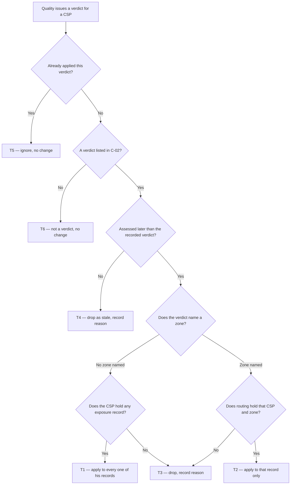

# Quality Verdict in Routing — what DAS does when Quality judges a CSP

| | | | |
|---|---|---|---|
| **Owner** — Ashish Raj (PM) | **Reviewer** — TBD ⚠️ *AI GENERATED — review* | **Status** — Draft | **Sign-off** — Pending |
| **Version** — v0.1 · 10 Aug 2026 | **Consulted — Quality OS** — TBD ⚠️ *AI GENERATED — review* | **Consulted — Allocation eng** — TBD ⚠️ *AI GENERATED — review* | **Consulted — Capacity & Coverage** — TBD ⚠️ *AI GENERATED — review* |

---

## 1. Objective & Definition of Success

**Objective.** A customer is not handed to a CSP that Quality has judged non-compliant, and a CSP who climbs back out is given work again — because routing acts on Quality's verdict from the moment it is issued.

**Boundary.** This spec governs one thing: how the routing domain receives a CSP's Quality verdict and where it records it.

It leaves unchanged:
- **How Quality decides the verdict.** The metrics, the cycles, the thresholds and the state machine behind them stay Quality's.
- **How a recorded verdict becomes a routing decision.** Turning a verdict into an exposure band, and a band into a rank, is existing behaviour under D&A OS §4.2 and §4.3. This spec supplies the input; it does not redefine the mapping (AC-REG-1).
- **Every other input to the band** — enforcement posture, exit state, zone eligibility, capacity cap. The most restrictive input still wins, exactly as before (AC-REG-1).
- **Work already in the CSP's hands.** A verdict applies from the moment it lands and does not reach back: allocations already assigned, accepted or active stay with him. This matches D&A OS §4.2, where a quality block stops new assignments and leaves existing connections alone (AC-REG-2).
- **How a new exposure record starts.** When a CSP is authorised in a zone he did not hold before, that new record begins at the eligibility path's own starting point, carrying no verdict — his standing is written to it by the next verdict Quality issues, not backdated onto it at creation (AC-REG-4). For up to one cycle, a blocked CSP is therefore routable in newly authorised territory. This is a conscious call, not an oversight.
- **What the CSP sees.** His quality strip in the app reads the Quality domain directly, not routing. No screen changes (AC-REG-3, §4).

Hard limits: a verdict never creates a routing exposure record (G1), and never reaches a zone it did not name (G2).

### Guardrails — promises that hold on every path

| ID | Guardrail | One line | Anchors |
|---|---|---|---|
| G1 | **No phantom exposure** | A verdict never brings a (CSP, zone) exposure record into existence — it only updates records that already exist. | R2 · AC-GRD-1 · AC-DRP-1 · AC-DRP-2 · MQ-4 |
| G2 | **No scope widening** | A verdict that names a zone changes that zone and no other. | R2b · AC-GRD-2 · AC-APP-2 · MQ-3 |
| G3 | **No stale overwrite** | A verdict assessed earlier never replaces one assessed later, however late it arrives. | R3 · AC-GRD-3 · AC-DRP-3 · MQ-1 |

### Success metrics

| ID | Metric | Baseline | Target | Source |
|---|---|---|---|---|
| M1 | Share of new allocations assigned to a CSP whose current recorded verdict is non-compliant | Unbounded — routing has never held a live verdict, so no CSP has ever been withheld work on quality grounds | 0% ⚠️ *AI GENERATED — review* | MQ-2 |
| M2 | Share of verdicts Quality issues that routing either applies or drops with a recorded reason. A verdict applied after C-01 still counts as applied — lateness is a separate finding under MQ-1 (AC-FAIL-1), not an M2 miss | 0% — no verdict has ever reached routing | 100% ⚠️ *AI GENERATED — review* | MQ-1 |
| M3 | Share of multi-zone CSPs whose every exposure record carries the CSP's current verdict at cycle close | n/a — new capability | 100% ⚠️ *AI GENERATED — review* | MQ-3 |

**Invariant (not a metric):** G1 — exposure records created by a verdict = 0, zero tolerance. Monitored via MQ-4, not trended.

---

## 2. User Stories & Rules

| ID | Story | MUST | MUST NOT |
|---|---|---|---|
| R1 | As routing, I want the CSP's current Quality verdict so that I stop sending new customers to a CSP Quality has judged non-compliant, and start again when he recovers. | **(a)** Accept the verdicts listed in C-02 — compliant, at risk, non-compliant, recovering — as the CSP's judged standing. **(b)** Record the verdict against the CSP's exposure records within C-01 of Quality issuing it. **(c)** Let the recorded verdict feed the exposure band by the existing D&A OS §4.2 rules; this spec sets the input, not the band. | Treat "could not judge him" as a verdict. A signal that Quality had insufficient data leaves the recorded verdict and the band exactly as they were — a CSP cannot be released from a block by going quiet. |
| R2 | As the Quality domain, when I name no zone I mean the CSP everywhere; when I name a zone I mean that zone only. | **(a)** A verdict with no zone named applies to every exposure record the CSP holds. **(b)** A verdict naming a zone routing holds for that CSP applies to that one record. **(c)** Treat an absent zone, an empty zone, and the placeholder value in C-03 as "no zone named". | **(a)** Create an exposure record for a CSP or a zone (G1). **(b)** Apply a zone-named verdict to any other zone of that CSP, or widen it to all zones because the named zone is unrecognised (G2). |
| R3 | As routing, I want the CSP's latest judged standing, not the last message that happened to arrive. | Keep the verdict Quality assessed most recently, comparing Quality's assessment time — never arrival time. | Let a re-delivered or delayed verdict replace a verdict assessed later or at the same instant (G3). |
| R4 | As the PM, I want to know a verdict was acted on, because this pipe has been silently dead once already. | Record, for every verdict received, whether it was applied or dropped and the reason for the drop. | Discard a verdict without a recorded reason. |

---

## 3. System Behaviour

### 3a. System flow chart

**Precedence — simultaneous verdicts.** Two verdicts for the same CSP arriving together are resolved by Quality's assessment time: the later one is applied and the other is dropped as stale, whichever is read first (AC-RACE-1). Two verdicts carrying the *same* assessment time cannot be ranked by standing — the first applied wins and the second is dropped as stale, because it is not later (AC-RACE-2). ⚠️ *AI GENERATED — review*

### 3b. State transition table — canon

Lifecycle of the **recorded verdict** on a CSP's exposure record (created when the first verdict for that CSP is applied). Its states are the verdict values listed in C-02, plus *none* before the first verdict lands. The exposure record's own lifecycle — who creates it, when it is removed — is owned by the eligibility path and is out of scope; so is the band the recorded verdict feeds (§1 Boundary).

| ID | From | Action / Trigger | Rule / Check | To | Side-effects |
|---|---|---|---|---|---|
| T1 | Any recorded verdict, or none | A verdict arrives naming no zone | Assessed later than the recorded verdict (R3); the CSP holds at least one exposure record | The arriving verdict, on **every** exposure record the CSP holds | Band re-derived on each record by the existing §4.2 rules (R1c); no record created (G1); applied within C-01 (R1b); application recorded (R4). |
| T2 | Any recorded verdict, or none | A verdict arrives naming a zone routing holds for this CSP | Assessed later than the recorded verdict (R3) | The arriving verdict, on **that one** record | As T1, for that record only; no other zone of this CSP is touched (G2, R2b). |
| T3 | Any | A verdict arrives naming a zone routing does not hold for this CSP, **or** the CSP holds no exposure record at all | — | Unchanged | Verdict dropped; reason recorded (R4). No exposure record is created (G1). No widening to his other zones (G2). |
| T4 | Any | A verdict arrives assessed earlier than, or at the same instant as, the recorded verdict | — | Unchanged | Dropped as stale; reason recorded (R3, R4, G3). |
| T5 | Any | The same verdict is delivered again | Already applied | Unchanged | Ignored. No second application and no drop reason — a re-delivery is not a loss. |
| T6 | Any | Quality reports it could not judge the CSP this cycle | — | Unchanged | Not a verdict (R1 MUST NOT). Recorded verdict and band both untouched, so a block stays a block. |

**Failure envelope (C-01).** If a verdict is not in effect on all its target records by C-01, it counts as un-applied against MQ-1 and routing continues on the CSP's last recorded verdict — the last-known-state rule of D&A OS Appendix D. No CSP is blocked or released by the absence of a verdict. How the application is retried inside C-01 is the implementer's. ⚠️ *AI GENERATED — review*

---

## 4. Screen Requirements

**None.** This spec changes no screen. Routing has no interface, and the CSP's existing quality strip is served from the Quality domain directly, so it neither gains nor loses anything here (AC-REG-3). Recorded as an Override.

---

## 5. Configurability

| ID | Parameter | Default | Range | Who changes it |
|---|---|---|---|---|
| C-01 | Time from Quality issuing a verdict to it being in effect on the CSP's exposure records (R1b) | 60 seconds ⚠️ *AI GENERATED — review* | 0–5 minutes ⚠️ *AI GENERATED — review* | Engineering |
| C-02 | The verdicts routing acts on (R1a) | Compliant · At risk · Non-compliant · Recovering | Fixed in V1 | Product |
| C-03 | Placeholder value that means "no zone named" (R2c) | `DEFAULT` | Fixed in V1 | Product, with Quality OS |

---

## 6. Measurement

| ID | The system must be able to answer… | Feeds |
|---|---|---|
| MQ-1 | For each evaluation cycle: how many verdicts Quality issued, how many routing applied, and how many it dropped — broken down by drop reason. | M2 · R4 · G3 |
| MQ-2 | For each new allocation, what the assigned CSP's recorded verdict was at the moment of assignment. | M1 · R1 |
| MQ-3 | For each multi-zone CSP at cycle close, whether every one of his exposure records carries his current verdict. | M3 · G2 · R2a |
| MQ-4 | Whether any exposure record came into existence as a result of a verdict. | G1 invariant |

---

## 7. Acceptance Criteria

> Worked examples use CSP `a0a0m0` (three zones: `zone_1101`, `zone_3092`, `india_grid_002192694`), CSP `a0b1u5` (one zone: `zone_3092`) and CSP `a0a7h4` (authorised nowhere in routing). Cycle close is 12 Aug 2026, 02:00 IST. ⚠️ *AI GENERATED — review* — the CSP ids and zone ids are real, the pairings are illustrative.

### APP — Applying a verdict (T1, T2)

| AC | Given / When / Then | Verifies | Status |
|---|---|---|---|
| AC-APP-1 | **Given** `a0a0m0` holds exposure records in `zone_1101`, `zone_3092` and `india_grid_002192694`, all recorded compliant, **When** Quality issues a non-compliant verdict for `a0a0m0` at 02:00 on 12 Aug naming no zone, **Then** all three records read non-compliant within C-01 (60 s), and `a0a0m0` still holds exactly three records. | R1b · R2a · T1 · G1 | Settled |
| AC-APP-2 | **Given** the same three compliant records, **When** the 02:00 non-compliant verdict names `zone_3092`, **Then** only the `zone_3092` record reads non-compliant; `zone_1101` and `india_grid_002192694` still read compliant. | R2b · T2 · G2 | Settled |
| AC-APP-3 | **Given** the same three compliant records, **When** the 02:00 non-compliant verdict carries the literal zone value `DEFAULT`, **Then** all three records read non-compliant — the placeholder is read as "no zone named", not as a zone. | R2c · T1 · C-03 | Settled |
| AC-APP-4 | **Given** `a0b1u5` is recorded non-compliant in `zone_3092`, **When** Quality issues a recovering verdict for him at 02:00 on 12 Aug, **Then** the `zone_3092` record reads recovering and the band on that record is re-derived by the existing §4.2 rules — this spec asserts the input, not the resulting band. | R1a · R1c · T1 | Settled |

### DRP — Verdicts not applied (T3, T4, T6)

| AC | Given / When / Then | Verifies | Status |
|---|---|---|---|
| AC-DRP-1 | **Given** `a0b1u5` holds an exposure record only for `zone_3092`, **When** a non-compliant verdict names `india_grid_002192694`, **Then** the `zone_3092` record is unchanged, no record exists for `india_grid_002192694`, and the drop is recorded with the reason "zone not held for this CSP". | R2 MUST NOT (a)(b) · R4 · T3 · G1 · G2 | Settled |
| AC-DRP-2 | **Given** `a0a7h4` holds no exposure record anywhere in routing, **When** a compliant verdict arrives for him at 02:00 on 12 Aug, **Then** no record is created and the drop is recorded with the reason "CSP holds no exposure record". | R4 · T3 · G1 | Settled |
| AC-DRP-3 | **Given** `a0a0m0`'s three records read compliant from a verdict assessed 12 Aug 02:00, **When** a non-compliant verdict assessed 11 Aug 02:00 is delivered at 12 Aug 09:00, **Then** all three records still read compliant and the drop is recorded with the reason "stale". | R3 · T4 · G3 | Settled |
| AC-DRP-4 | **Given** `a0b1u5` is recorded non-compliant in `zone_3092` and receiving no new allocations, **When** Quality reports at 02:00 on 12 Aug that it had insufficient data to judge him, **Then** the record still reads non-compliant and his band is unchanged — he is not released. | R1 MUST NOT · T6 | Settled |

### DUP — Duplicate delivery (T5)

| AC | Given / When / Then | Verifies | Status |
|---|---|---|---|
| AC-DUP-1 | **Given** the AC-APP-1 verdict has been applied to all three records, **When** the identical verdict is delivered again at 02:05, **Then** all three records still read non-compliant, no further change is recorded against them, and no drop reason is recorded. | T5 · R4 | Settled |

### RACE — Simultaneous verdicts

| AC | Given / When / Then | Verifies | Status |
|---|---|---|---|
| AC-RACE-1 | **Given** `a0a0m0`'s three records read at risk from a verdict assessed 10 Aug 02:00, **When** two verdicts arrive together at 12 Aug 09:00 — compliant assessed 12 Aug 02:00 and non-compliant assessed 11 Aug 02:00 — **Then** all three records read compliant whichever of the two is read first, and the non-compliant verdict is dropped with the reason "stale". | R3 · T1 · T4 · G3 | Settled |
| AC-RACE-2 | **Given** `a0a0m0`'s three records read at risk from a verdict assessed 10 Aug 02:00, **When** two conflicting verdicts arrive together, both assessed 12 Aug 02:00:00 — one compliant, one non-compliant — **Then** exactly one is applied to all three records and the other is dropped with the reason "stale"; the three records never disagree with each other. | R3 · T1 · T4 · G3 | Settled |

### BV — Boundary values (assessment time)

| AC | Given / When / Then | Verifies | Status |
|---|---|---|---|
| AC-BV-1 | **Given** `a0a0m0`'s records hold a compliant verdict assessed 12 Aug 02:00:00, **When** a lone non-compliant verdict assessed at exactly 12 Aug 02:00:00 arrives, **Then** the records still read compliant and the arriving verdict is dropped as stale — equal is not later. | R3 · T4 · G3 | Settled |
| AC-BV-2 | **Given** the same records, **When** a non-compliant verdict assessed 12 Aug 02:00:01 arrives, **Then** all three records read non-compliant. | R3 · T1 | Settled |

### WF — Workflows (T1 → T1)

| AC | Given / When / Then | Verifies | Status |
|---|---|---|---|
| AC-WF-1 | **Given** `a0a0m0` is compliant across his three zones and holds one accepted allocation in `zone_1101`, **When** Quality issues non-compliant at 02:00 on 12 Aug and a new connection is requested in each of his three zones at 03:00, **Then** all three records read non-compliant within C-01 (60 s), none of the three new connections is assigned to him, and his accepted `zone_1101` allocation is still his and unchanged. | R1b · R2a · T1 · M1 · §1 Boundary | Settled |
| AC-WF-2 | **Given** the state at the end of AC-WF-1, **When** Quality issues a recovering verdict for `a0a0m0` at 02:00 on 26 Aug, **Then** all three records read recovering within C-01 and he is once more a candidate for new connections in all three zones, per the existing §4.2 rules. | R1a · R2a · T1 | Settled |

### FAIL — Failure window (C-01)

| AC | Given / When / Then | Verifies | Status |
|---|---|---|---|
| AC-FAIL-1 | **Given** Quality issues a non-compliant verdict for `a0a0m0` at 02:00:00 on 12 Aug, **When** C-01 (60 s) expires at 02:01:00 with the verdict applied to only two of his three records, **Then** the third record still holds his previous verdict and routing continues on it, the shortfall appears in MQ-1 as an un-applied verdict, and no record has been created or removed. | C-01 · R4 · MQ-1 · G1 | Settled |

### REG — Regression (§1 Boundary)

| AC | Given / When / Then | Verifies | Status |
|---|---|---|---|
| AC-REG-1 | **Given** `a0b1u5` is barred from new allocations in `zone_3092` by his enforcement posture, **When** a compliant verdict arrives for him at 02:00 on 12 Aug, **Then** his recorded verdict reads compliant and he is still barred — the most restrictive input across quality, enforcement, exit and capacity still decides the band, exactly as before this spec. | §1 Boundary · R1c | Settled |
| AC-REG-2 | **Given** `a0a0m0` holds one assigned-not-accepted, one accepted and one active allocation, **When** a non-compliant verdict arrives at 02:00 on 12 Aug, **Then** all three allocations are still his and unchanged — only new allocations are affected. | §1 Boundary · T1 | Settled |
| AC-REG-3 | **Given** `a0a0m0` opens his quality strip in the CSP app, **When** any verdict is applied in routing, **Then** the strip shows exactly what it showed before this spec shipped — it is served from the Quality domain, not from routing. | §1 Boundary | Settled |
| AC-REG-4 | **Given** `a0b1u5` is recorded non-compliant in `zone_3092`, **When** the eligibility path authorises him in `zone_1101` on 13 Aug, **Then** the new `zone_1101` record holds no verdict and starts wherever the eligibility path starts it — nothing is backdated onto it — and it first reads non-compliant only when Quality's next verdict lands. | §1 Boundary · G1 · T1 | Settled |

### GRD — Guardrails

| AC | Given / When / Then | Verifies | Status |
|---|---|---|---|
| AC-GRD-1 | **Given** `a0a0m0` holds exactly three exposure records, **When** a verdict is sent down each path of §3a in turn — no zone named, zone named and held, zone named and not held, stale, duplicate, and not-a-verdict — **Then** he still holds exactly three records after every one of them, and no record exists for any zone he was not already authorised in. | G1 · MQ-4 | Settled |
| AC-GRD-2 | **Given** `a0a0m0` holds records in `zone_1101`, `zone_3092` and `india_grid_002192694`, **When** a verdict naming `zone_3092` is applied, **Then** the other two records are unchanged in every respect, and no record belonging to any other CSP changes. | G2 · MQ-3 | Settled |
| AC-GRD-3 | **Given** `a0a0m0`'s `zone_1101` record, **When** the verdicts of AC-APP-1, AC-DRP-3, AC-BV-1 and AC-BV-2 are delivered in any order, **Then** the assessment time on the recorded verdict never moves backwards. | G3 · MQ-1 | Settled |

---

## 8. Glossary

| Term | Meaning | Owner (domain) |
|---|---|---|
| Verdict | **Canonical definition:** the Quality domain's judgement of a CSP's standing for an evaluation cycle, being one of the values listed in C-02 — compliant, at risk, non-compliant, recovering. A statement that Quality had insufficient data to judge him is **not** a verdict (R1 MUST NOT, T6). All other mentions cite this definition. | Quality |
| Recorded verdict | The verdict routing is currently holding for a CSP on one of his exposure records. This spec governs how it gets there; §1 Boundary governs what it then does. | Allocation |
| Exposure record | The routing domain's per-CSP-per-zone entry that decides whether, and how strongly, a CSP is offered new connections in that zone. Created by the eligibility path, never by a verdict (G1). | Allocation |
| Zone-scoped verdict | A verdict that names a single zone, meaning it applies to that CSP in that zone only (R2b). The Quality domain does not issue these today; this spec defines how routing will honour one if it ever does. | Quality |
| Assessment time | The instant the Quality domain decided a verdict — not the instant routing received it. The sole basis for deciding which of two verdicts is newer (R3). | Quality |
| Exposure band | The routing intensity a CSP holds in a zone, derived from his recorded verdict together with enforcement, exit and capacity inputs, under D&A OS §4.2. Out of scope here; this spec only supplies one of its inputs. | Allocation |

---

## 9. Notes for System Capabilities

What the platform must be able to do for this feature to exist. Whether these are one system or several, and how they interact, is the implementer's design.

| Capability | Needed by |
|---|---|
| Receive a CSP's Quality verdict from the quality domain and hold it against that CSP's routing exposure records, in effect within C-01. | R1 · T1 · T2 · C-01 |
| Distinguish a verdict scoped to one zone from one scoped to the whole CSP — including recognising the C-03 placeholder as "no zone named" — and honour the narrower scope without ever widening it. | R2 · G2 · T2 · T3 · C-03 |
| Order verdicts by the time the quality domain assessed them rather than the time they arrive, and reject anything not strictly later than what is held. | R3 · G3 · T4 |
| Update every exposure record a CSP holds from a single CSP-scoped verdict, without bringing any record into existence. | R2a · G1 · T1 · MQ-3 · MQ-4 |
| Record, for every verdict received, whether it was applied or dropped and why. | R4 · MQ-1 |
| Answer, for any new allocation, what the assigned CSP's recorded verdict was at the moment of assignment. | MQ-2 · M1 |

---

## AI-generated content for review

| Location | What was generated | Basis |
|---|---|---|
| Header — Reviewer, Consulted (Quality OS, Allocation eng, Capacity & Coverage) | All four names left as TBD | You named nobody. Deliberately not filled from memory — a wrong name has shipped in a deliverable before. Sign-off is blocked until these are real. |
| §1 M1 target — 0% | Target value | Inferred from the objective. You said the point is that a non-compliant CSP stops getting new work; 0% is the literal reading. Confirm you want zero rather than a tolerance. |
| §1 M2 target — 100% | Target value | Inferred from R4 ("no silent loss"). Every verdict is either applied or has a reason, so 100% is definitional rather than ambitious. |
| §1 M3 target — 100% | Target value | Inferred from R2a. If fan-out works, every record carries the verdict; anything under 100% is a defect, not a shortfall. |
| §3a Precedence — same assessment time | The rule that equal assessment times resolve first-wins, second dropped as stale, and the two ACs that test it (AC-RACE-2, AC-BV-1) | Not asked. "Newest wins" leaves the equal case undefined; two verdicts with the same assessment time cannot be ranked by standing, so the tie is broken deterministically rather than by arrival luck. Confirm, or say Quality can never produce a tie. |
| §3b Failure envelope (C-01) | Routing continues on the last recorded verdict when C-01 expires un-applied | Read from D&A OS Appendix D, which specifies last-known SLA state as the degraded-mode behaviour when Quality is unavailable. Applied here by analogy to a late verdict. |
| §5 C-01 — 60 seconds, range 0–5 minutes | Default and range | No number was given. Quality issues verdicts once per decider day, so nothing depends on sub-minute latency; 60 s is a loose bound that still makes a stuck pipe visible. Owner set to Engineering. |
| §7 preamble and worked data throughout | `a0a0m0` in three named zones, `a0b1u5` in one, `a0a7h4` in none; the 12 Aug cycle close, the 13 Aug authorisation in AC-REG-4 and the 26 Aug recovery in AC-WF-2 | The CSP ids and zone ids are real (from the Quality QA fixtures and the July routing audit), but which CSP sits in which zone is illustrative, and the dates assume a fortnightly decider cadence. Swap in a genuine multi-zone CSP and the real cadence before these become tests. |

---

## Overrides

| Rule | What was done instead | Rationale | Approved by |
|---|---|---|---|
| §4 Screen Requirements — one block per screen | Section states "none" with the reason | Routing has no interface, and the CSP's quality strip is served from the Quality domain, so no screen changes. Stating this is the regression contract (AC-REG-3); inventing a screen block would not be. | Ashish Raj (PM) — scope instruction: "listens to the quality verdict, updates the CSP state, nothing else" |
| §7 — a Configurability AC where a runtime change is customer-visible | No CFG AC | Neither runtime-changeable C-id is customer-visible: C-01 is an internal latency bound and C-02/C-03 are fixed in V1. The coverage contract requires a CFG AC only where a runtime change is customer-visible. | Ashish Raj (PM) |
| §1 — a guardrail for forward-effectiveness | Stated in the Boundary and tested by AC-REG-2, not given a G-id | It is a statement of what this spec leaves alone, not a promise the spec makes on every path. D&A OS §4.2 already owns it. Promoting it to a guardrail would have required an MQ for a property nothing in this spec can violate. | Ashish Raj (PM) |
